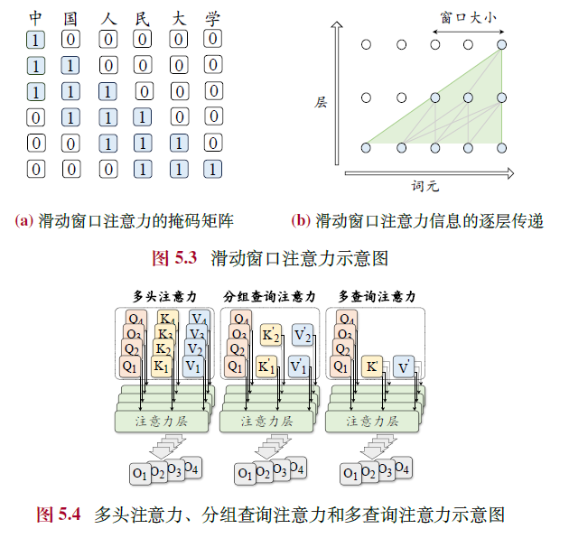

# 第一部分 背景与基础
## 第二章
### 2.1 LLM构建
**预训练**
- 大模型预训练是对世界知识的压缩，得到的模型编码了世界知识。
- 经验性技术：数据配比，学习率调整，提早发现训练异常  

**SFT 与 对齐**
- SFT 主要是对模型能力激发的作用，而不是知识注入
- RM + RLHF 
- 直接使用SFT，简化对齐过程

### 2.2 扩展法则-scaling law
- 模型规模，数据规模，算力之间的幂律关系
- 使用小模型性能预测大模型的性能
- 使用训练初期大模型的性能预测最终大模型的性能

要确定大模型的规模，数据量，数据配比等

**KM扩展-openai**  
**chinchilla-deep mind**  
在数据量方面，是越多越好，例如llama2是2T，到了llama3是15T。说明模型对数据的容纳能力还没到上限

可能出现的问题：
- 如果模型对于数据的容纳能力还有很大空间，那么，数据就相对缺乏了，但目前的训练数据，可以说已经“掏空”了互联网  
- 预训练的交叉熵损失是否与模型性能关联？这也是scaling law的问题

### 2.3 涌现能力
量变引起质变
随着模型变大，数据增多，类似打通任督二脉，在某些任务取得跨越式进步  
- GPT3因为模型加大，具有了**上下文学习能力**，即在prompt中加入示例就可以得到想要的输出。这在GPT1-2中没有
- 指令遵循-通过SFT可以更好完成任务
- 利用思维链逐步推理

### 2.4 GPT系列演进
- openai关于扩展法则的论文是2020年的，即那时候已经为GPT3的工作铺好了基础
- GPT3是一个里程碑-证明了超大规模神经网络的超级性能以及使用方法-decoder-only

## 第三章 资源
### 使用--API or Checkpoint
### 训练--data
预训练数据集--T token级别，TB数量级
SFT数据集--万-百万级别
RLHF数据集--万-百万级别

# 第二部分 预训练
## 第四章 数据

通用数据-网页，书籍
专用数据-多语言，科研，code

- 数据清洗  
过滤：短的，重复的，高频词，低质(点赞少评论少，fasttext分类)，敏感(手机信箱ip)
去重：很重要，句子级别，文档级别，数据集级别
### 数据的量与质对模型的影响
- 数据量多多益善
- 大量低质量数据不如少量高质量数据(但如果超几个数量级呢？)
- 去重非常重要，少量数据的大量重复也会污染模型

### 分词
BPE与ByteBPE
### 数据调度
数据比例与数据顺序
由简到繁由短到长
即便是训练一个中英为主的大模型，英文数据也是占绝对比例的，例如中英1：5（为什么？因为测试集是英文的？或者说，截至现在，还是这样吗）

## 第五章 模型结构
主流架构：Decoder-Only
- 激活函数  
ReLU-GELU-SwiGLU

- 注意力机制  
完整注意力机制 ， 稀疏注意力机制 ， GQA

- MoE 混合专家模型

### 长上下文模型
- 位置编码的扩展

### 新模型架构
Transformer的缺点
长序列的注意力计算爆炸问题

## 第六章 预训练

# 第三部分 微调与对齐
## 第七章 微调
### 什么是微调
为什么需要微调？
预训练出来的模型只是一个“下一词预测器”。  
但实际上我们需要它不仅仅是一个“下一词预测器”。  
我们需要他：
- 完成一些NLP任务：翻译，文本分类，文本摘要等等
- 进一步成为一个对话机器人，机器助理  

例如同样一个问题“美国首都是哪里”，我可能需要让模型翻译成英语，也可能是让他回答这个问题。如果仅仅是一个“下一词预测器”，那么它的输出可能是“呢？”  
怎样利用“下一词预测”这一基础功能，实现多样的任务？即**指令微调**也叫SFT。  
其实就是给他很多例子，这些例子就是一个个对应的问答模板：  
“翻译以下句子成英文，美国首都是哪里，what is the capital of the United States”  
“回答问题，美国首都是哪里，华盛顿”  
即包括：任务描述，输入，输出三个部分  
而有趣的是，这样的微调不需要巨量的样本，仅需要几百万条如此的数据就可以取得很好的效果。

在解决了基础的nlp任务之后，就是向对话机器人以及机器助理方向发展
如此，训练数据即就更需要丰富，因为对话不一定是某种具体的任务，而是一种交流。所以数据集也是要人工生成互相交流的数据给模型。而且对话也是多轮的，模型需要记住之前的对话。  
甚至可以让模型生成数据自己（人工筛查其中的数据后）训练自己

**指令微调是为了解锁大模型的能力。在巨量数据训练之后，合理引导模型输出其知识**  
微调的学习率会低一个数量级

### 高效微调-LoRA

在微调过程中，参数需要更新$$W=W_0+\Delta W$$其中$W_0$即预训练模型权重，而$$\Delta W = A \cdot B^T$$其中$A\in R^{H\times R} ,B\in R^{H\times R} $ R<< H是减小后的秩（Low-Rank）  
在微调中，$W_0$固定不变，只更新低秩的AB，从而缩减计算量和显存用量  
前向过程$$h=W_0 \cdot x + A \cdot B^T \cdot x$$
训练完成后，$$W=W_0+A \cdot B^T$$
#### 显存
以llama为例，LoRA层加在前馈部分，显存可以缩减至原1/8
进一步QLoRA可以缩减至1/32，即量化至4比特

## 第八章 人类对齐

### 为什么
经过了微调，大模型可以完成一些任务了，  
但是，他是一个冰冷的任务机器，根据他所学习的世界知识，给予最“客观”的回答。  
但问题是，世界知识也包含了很多有毒有害少儿不宜的内容。  
在有意无意诱导下，大模型会输出这些信息。  
所以要给这个模型一个“正能量价值观”。  
这被称为“人类对齐Human Alignment”。实际上是**向理想的人类对齐**，抑或是**向人类理想地对齐**   
大模型要做到：有用，诚实，无害  
一个例子：  

### 怎么做
#### 基于人类反馈的强化学习
既然要向人类对齐，那必须要有人类的评分作为依据
宏观流程可以视作：  
步骤A 模型给输出  
步骤B 人类给评分  
步骤C 根据B评分和一定的策略修改模型  

步骤B效率不高，所以根据B训练一个打分模型**Reward Model**  
步骤C即使用强化学习
1. 为什么是强化学习？  
强化学习类似训练宠物：可以理解为做对了给块糖，做不对给大棒。  
对于有监督学习，是有真实label的，通过输出y和真实y可以计算损失。  
但是，对于人类对齐这个任务，有输出y，而怎么界定一个真实y呢？并不好界定，所以干脆不定义真实的y，只定义输出y的分数。  
就像强化学习的训练机器打游戏一样，每一个操作并没有标准的y来计算损失，而是通过最终的输赢来回溯操作的损失。  
即我没有标准答案给你，但我可以告诉你这个行为好不好。这更像是对**抽象目标**的一种合理的拟合方式。类似“文无第一武无第二”的感觉。
2. 关键在于RM模型训练
机器给输出，人类给评分。然后收集这些数据，训练一个打分器
或者机器给出多个输出，人类给排序。
#### 具体算法
PPO DPO
todo。。。

# 第四部分 大模型应用
## 第九章 解码与部署
### 解码
如何挑选下一个词？  
- 贪心搜索-每次选概率最高的-但这样会导致结果单一，失去多样性。以下改进：  
    - 束搜索
    - 长度惩罚-不能输出太短
    - 重复惩罚
- 概率采样-在高概率的一组词中选择一个或多个，组成几组输出然后选择  
    - 温度采样-在计算softmax中，增加一个被除数T，T越大，softmax分数越均匀，随机采样越随机
    - top-k 固定采前k个
    - top-p 采概率加起来=p的前n个
    - 对比解码

### 部署
#### 量化
#### 蒸馏
#### 剪枝

## 第十章 提示学习
咒语
上下文学习
思维链提示

# 第五部分 评测与应用
## 应用
- 信息检索-RAG
- 推荐系统
    - 基于提示的方法
    - 基于微调
        - 文字描述
        - 物品id扩展词表
- 多模态LLM
    - 语音-TTS STT
        - STT： 语音-短时傅里叶变换-mel频谱-图像-卷积-向量-transformer
    - 图像-文生图 图生文
        - 图生文：图像分割为patch-卷积-向量-transformer ViT  CLIP
- 知识图谱
